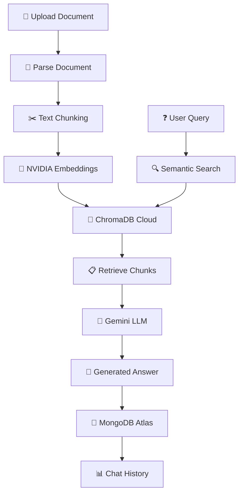

<div align="center">

# 📚 Knowledgebase RAG

### 🤖 Chat with Your Documents Using AI

*Transform your documents into an interactive knowledge base powered by advanced RAG technology*

[](https://github.com/yourusername/knowledgebase-rag/stargazers)
[](https://opensource.org/licenses/MIT)
[](https://www.python.org/)
[](https://reactjs.org/)
[](https://www.typescriptlang.org/)

[🚀 Try Live Demo](https://your-deployed-website.com) • [🚀 Quick Start](#-quick-start) • [📚 Documentation](#-documentation) • [💬 Community](#-community)

</div>

---

## 🌐 Live Demo

<div align="center">

**[🚀 Try Knowledgebase RAG Now](https://your-deployed-website.com)**

Experience the power of AI-driven document conversations. Upload your documents and start asking questions!

</div>

## 🎯 What is Knowledgebase RAG?

Knowledgebase RAG is an intelligent **AI-powered document assistant** that uses Retrieval-Augmented Generation (RAG) to enable natural conversations with your documents. Upload PDFs or DOCX files and get accurate, contextual answers powered by cutting-edge AI models! Built with a modern React + TypeScript frontend and FastAPI backend. ✨

## 🌟 Key Features

<table>
<tr>
<td width="50%">

### 📄 **Multi-Format Support**
- **PDF Processing** with PyPDF2
- **DOCX Processing** with python-docx
- Smart text extraction & chunking

### 🧠 **Advanced AI Stack**
- **NVIDIA Embedding API** for vector generation
- **Google Gemini LLM** for answer generation
- Context-aware responses

</td>
<td width="50%">

### 💾 **Cloud-Native Storage**
- **ChromaDB Cloud** for vector embeddings
- **MongoDB Atlas** for chat history
- Scalable and persistent

### 🔍 **Semantic Search**
- Lightning-fast document retrieval
- Context-aware chunking
- Conversational memory
- Session management

</td>
</tr>
</table>

## 🚀 Quick Start

### Prerequisites

Before you begin, ensure you have:
- 🐍 **Python 3.8+** installed
- 📦 **Node.js 18+** installed
- 🔑 **API Keys** (NVIDIA, Google Gemini)
- ☁️ **Cloud Accounts** (ChromaDB Cloud, MongoDB Atlas)

### Installation

```bash
# 1️⃣ Clone the repository
git clone https://github.com/yourusername/knowledgebase-rag.git
cd knowledgebase-rag

# 2️⃣ Backend Setup
cd backend
python -m venv venv

# Activate virtual environment
# On Windows:
venv\Scripts\activate
# On macOS/Linux:
source venv/bin/activate

# Install backend dependencies
pip install -r requirements.txt

# 3️⃣ Configure environment variables
cp .env.example .env
# Edit .env file with your API keys and connection strings

# 4️⃣ Frontend Setup
cd ../frontend
npm install

# 5️⃣ Start the development servers
# Terminal 1 - Backend
cd backend
uvicorn main:app --reload

# Terminal 2 - Frontend (in another terminal)
cd frontend
npm run dev
```

### 🎉 Launch

- **Backend:** Open `http://localhost:8000`
- **Frontend:** Open `http://localhost:5173`

That's it! Start chatting with your documents! 🚀

## 🔑 API & Service Setup

<details>
<summary><b>🟢 NVIDIA Embedding API</b></summary>

1. Visit [build.nvidia.com](https://build.nvidia.com/)
2. Sign up for a free account
3. Navigate to API Keys section
4. Generate your embedding API key
5. Add to `.env`: `NVIDIA_API_KEY=your_key_here`

**Used for:** Generating high-quality vector embeddings
</details>

<details>
<summary><b>🔵 Google Gemini API</b></summary>

1. Visit [Google AI Studio](https://makersuite.google.com/app/apikey)
2. Create or sign in to your Google account
3. Generate your Gemini API key
4. Add to `.env`: `GEMINI_API_KEY=your_key_here`

**Used for:** Natural language answer generation
</details>

<details>
<summary><b>🟣 ChromaDB Cloud</b></summary>

1. Visit [ChromaDB Cloud](https://www.trychroma.com/)
2. Sign up for an account
3. Create a new collection
4. Get your connection credentials
5. Add to `.env`: `CHROMADB_URL=your_url_here`

**Used for:** Storing and querying vector embeddings
</details>

<details>
<summary><b>🟤 MongoDB Atlas</b></summary>

1. Visit [MongoDB Atlas](https://www.mongodb.com/cloud/atlas)
2. Create a free cluster
3. Set up database user and IP whitelist
4. Get your connection string
5. Add to `.env`: `MONGODB_URI=your_connection_string`

**Used for:** Persisting chat history and conversations
</details>

## 📚 Documentation

### 🏗️ Architecture Overview



### 🔄 How It Works

**1. Document Processing**
- Documents (PDF/DOCX) are uploaded through the React interface
- FastAPI backend receives and processes files
- PyPDF2 or python-docx extracts text content
- Text is split into semantic chunks for better context

**2. Embedding & Storage**
- Each chunk is converted to vectors using NVIDIA Embedding API
- Vectors are stored in ChromaDB Cloud with metadata
- Enables fast semantic similarity search

**3. Query & Retrieval**
- User questions are submitted via React frontend
- FastAPI backend embeds questions using NVIDIA API
- Semantic search finds most relevant document chunks
- Context is passed to Gemini for answer generation

**4. Conversation Management**
- All interactions are saved to MongoDB Atlas
- Chat history maintains context across sessions
- Users can access previous conversations
- Real-time updates via FastAPI WebSocket connections

### 🎯 Use Cases

| Use Case | Description | Perfect For |
|----------|-------------|-------------|
| 📖 **Research Assistant** | Query research papers & documents | Researchers, Students |
| 📋 **Document Analysis** | Extract insights from reports | Business Analysts |
| 🏢 **Knowledge Base** | Company documentation Q&A | Enterprises, Teams |
| 📚 **Study Helper** | Interactive learning from textbooks | Students, Educators |
| ⚖️ **Legal Research** | Query legal documents & contracts | Lawyers, Paralegals |

### 🔧 Technology Stack

<div align="center">

| Category | Technologies |
|----------|-------------|
| **Frontend** |    |
| **Backend** |    |
| **Document Parsing** |   |
| **AI & Embeddings** |   |
| **Databases** |   |

</div>

## 📁 Project Structure

```
knowledgebase-rag/
├── frontend/
│   ├── src/
│   │   ├── components/      # React components (.tsx)
│   │   ├── pages/          # Page components
│   │   ├── services/       # API integration
│   │   ├── types/          # TypeScript types
│   │   └── App.tsx         # Main application
│   ├── package.json
│   └── vite.config.ts
│
├── backend/
│   ├── main.py             # FastAPI application entry
│   ├── api/
│   │   ├── routes/         # API endpoints
│   │   └── dependencies.py # Shared dependencies
│   ├── services/
│   │   ├── document_parser.py  # PDF/DOCX parsing
│   │   ├── embeddings.py       # NVIDIA embedding integration
│   │   ├── vector_store.py     # ChromaDB operations
│   │   ├── llm.py             # Gemini LLM integration
│   │   └── database.py        # MongoDB operations
│   ├── models/
│   │   └── schemas.py      # Pydantic models
│   ├── utils/
│   │   ├── chunking.py     # Text chunking utilities
│   │   └── config.py       # Configuration management
│   └── requirements.txt
│
├── .env.example
├── .gitignore
└── README.md
```

## 🤝 Contributing

We love contributions! Here's how you can help make Knowledgebase RAG even better:

### 🐛 Found a Bug?
Open an [issue](https://github.com/yourusername/knowledgebase-rag/issues) with detailed reproduction steps.

### 💡 Have an Idea?
We'd love to hear it! Open a [feature request](https://github.com/yourusername/knowledgebase-rag/issues/new?template=feature_request.md).

### 🔧 Want to Code?
1. Fork the repository
2. Create a feature branch (`git checkout -b feature/amazing-feature`)
3. Commit your changes (`git commit -m 'Add amazing feature'`)
4. Push to the branch (`git push origin feature/amazing-feature`)
5. Open a Pull Request

## 🌟 Community

<div align="center">

### Join our growing community of developers!

[](https://github.com/yourusername/knowledgebase-rag/discussions)
[](https://discord.gg/knowledgebase)
[](https://twitter.com/knowledgebase_ai)

</div>

## 📈 Roadmap

- [ ] 🔌 **Additional LLM Providers** (OpenAI, Claude, Llama)
- [ ] 📊 **Advanced Analytics** dashboard
- [ ] 🌐 **Multi-language Support**
- [ ] 🔊 **Audio Document Processing**
- [ ] 📱 **Mobile Application**
- [ ] 🔗 **REST API Documentation** with Swagger
- [ ] 🎨 **Custom Theming**
- [ ] 👥 **Multi-user Support & Collaboration**
- [ ] 🔐 **Role-based Access Control**
- [ ] 📤 **Export Conversations**

## ⚙️ Configuration

### Environment Variables

Create a `.env` file in the backend directory:

```env
# NVIDIA Embedding API
NVIDIA_API_KEY=your_nvidia_api_key

# Google Gemini API
GEMINI_API_KEY=your_gemini_api_key

# ChromaDB Cloud
CHROMADB_URL=your_chromadb_cloud_url
CHROMADB_API_KEY=your_chromadb_api_key

# MongoDB Atlas
MONGODB_URI=your_mongodb_api
# FastAPI Configuration
API_HOST=0.0.0.0
API_PORT=8000
CORS_ORIGINS=http://localhost:5173

# Optional Configuration
CHUNK_SIZE=1000
CHUNK_OVERLAP=200
MAX_CHUNKS_RETURNED=5
MAX_FILE_SIZE=10485760  # 10MB
```

## 🔒 Security

- All API keys are stored securely in `.env` file
- `.env` file is git-ignored for security
- MongoDB connections use encrypted connections
- ChromaDB Cloud provides secure vector storage
- CORS configured for frontend-backend communication
- File upload size limits enforced
- Input validation with Pydantic models

## 📄 License

This project is licensed under the MIT License - see the [LICENSE](LICENSE) file for details.

## 🙏 Acknowledgments

- 🧠 **NVIDIA** for providing powerful embedding APIs
- 🤖 **Google** for Gemini LLM capabilities
- 💾 **ChromaDB Team** for vector database solution
- 🍃 **MongoDB** for reliable document storage
- ⚡ **FastAPI Team** for the amazing web framework
- ⚛️ **React Team** for the frontend library
- 👥 **Open Source Community** for inspiration and tools
- 🌟 **Contributors** who help make this project better

---

<div align="center">

### ⭐ Star us on GitHub if Knowledgebase RAG helps you work smarter with your documents!

**Made with ❤️ for the AI and Developer community**

[⬆️ Back to top](#-knowledgebase-rag)

</div>